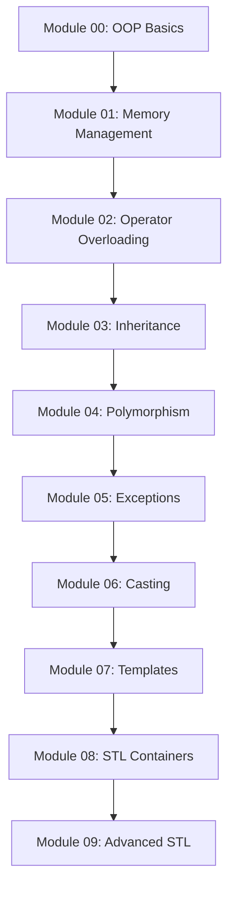

<div align="center">

# 🚀 CPP Modules

### *A Journey Through Modern C++ Programming*


**Master C++ from fundamentals to advanced concepts through hands-on exercises**

[Getting Started](#-getting-started) • [Modules](#-modules) • [Compilation](#-compilation) • [Learning Path](#-learning-path)

</div>

---

## 📚 About The Project

This repository contains a comprehensive collection of **10 C++ modules** covering everything from basic object-oriented programming to advanced template metaprogramming and STL usage. Each module is designed to progressively build your C++ expertise through practical, hands-on exercises.

> **Note**: All projects follow the **C++98 standard** and adhere to strict coding guidelines with `-Wall -Wextra -Werror` compilation flags.

---

## 🎯 Modules

<table>
<thead>
<tr>
<th width="120">Module</th>
<th width="300">Focus Area</th>
<th>Key Concepts</th>
<th width="100">Exercises</th>
</tr>
</thead>
<tbody>

<tr>
<td align="center">
<a href="./CPP%20Module%2000"></a>
</td>
<td><strong>Namespaces, Classes & I/O</strong></td>
<td>
• Namespaces<br>
• Classes & Objects<br>
• Member Functions<br>
• stdio Streams<br>
• Initialization Lists
</td>
<td align="center">
<a href="./CPP%20Module%2000/ex00">ex00</a><br>
<a href="./CPP%20Module%2000/ex01">ex01</a><br>
<a href="./CPP%20Module%2000/ex02">ex02</a>
</td>
</tr>

<tr>
<td align="center">
<a href="./CPP%20Module%2001"></a>
</td>
<td><strong>Memory & References</strong></td>
<td>
• Memory Allocation<br>
• Pointers to Members<br>
• References<br>
• Stack vs Heap
</td>
<td align="center">
<a href="./CPP%20Module%2001">View</a>
</td>
</tr>

<tr>
<td align="center">
<a href="./CPP%20Module%2002"></a>
</td>
<td><strong>Operator Overloading</strong></td>
<td>
• Ad-hoc Polymorphism<br>
• Operator Overloading<br>
• Orthodox Canonical Form<br>
• Fixed-point Numbers
</td>
<td align="center">
<a href="./CPP%20Module%2002">View</a>
</td>
</tr>

<tr>
<td align="center">
<a href="./CPP%20Module%2003"></a>
</td>
<td><strong>Inheritance</strong></td>
<td>
• Inheritance Basics<br>
• Base & Derived Classes<br>
• Access Specifiers<br>
• Multiple Inheritance
</td>
<td align="center">
<a href="./CPP%20Module%2003">View</a>
</td>
</tr>

<tr>
<td align="center">
<a href="./CPP%20Module%2004"></a>
</td>
<td><strong>Polymorphism & Interfaces</strong></td>
<td>
• Subtype Polymorphism<br>
• Abstract Classes<br>
• Interfaces<br>
• Virtual Functions
</td>
<td align="center">
<a href="./CPP%20Module%2004">View</a>
</td>
</tr>

<tr>
<td align="center">
<a href="./CPP%20Module%2005"></a>
</td>
<td><strong>Exceptions</strong></td>
<td>
• Try/Catch Blocks<br>
• Exception Classes<br>
• Custom Exceptions<br>
• RAII Pattern
</td>
<td align="center">
<a href="./CPP%20Module%2005">View</a>
</td>
</tr>

<tr>
<td align="center">
<a href="./CPP%20Module%2006"></a>
</td>
<td><strong>C++ Casts</strong></td>
<td>
• Static Cast<br>
• Dynamic Cast<br>
• Const Cast<br>
• Reinterpret Cast
</td>
<td align="center">
<a href="./CPP%20Module%2006">View</a>
</td>
</tr>

<tr>
<td align="center">
<a href="./CPP%20Module%2007"></a>
</td>
<td><strong>Templates</strong></td>
<td>
• Function Templates<br>
• Class Templates<br>
• Template Specialization<br>
• Generic Programming
</td>
<td align="center">
<a href="./CPP%20Module%2007">View</a>
</td>
</tr>

<tr>
<td align="center">
<a href="./CPP%20Module%2008"></a>
</td>
<td><strong>Containers & Iterators</strong></td>
<td>
• STL Containers<br>
• Iterators<br>
• Algorithms<br>
• Container Adaptors
</td>
<td align="center">
<a href="./CPP%20Module%2008">View</a>
</td>
</tr>

<tr>
<td align="center">
<a href="./CPP%20Module%2009"></a>
</td>
<td><strong>Advanced STL</strong></td>
<td>
• Advanced STL Usage<br>
• Algorithm Composition<br>
• Performance<br>
• Best Practices
</td>
<td align="center">
<a href="./CPP%20Module%2009">View</a>
</td>
</tr>

</tbody>
</table>

---

## 🛠️ Getting Started

### Prerequisites

```bash
# Minimum requirements
- C++ Compiler (g++ or clang++)
- Make utility
- C++98 standard support
```

### Installation

```bash
# Clone the repository
git clone https://github.com/ssbaytri/CPP-Modules. git

# Navigate to the project
cd CPP-Modules

# Choose a module
cd "CPP Module 00"
```

---

## ⚙️ Compilation

Each exercise comes with its own Makefile.  Here's how to use it:

```bash
# Navigate to any exercise
cd "CPP Module 00/ex00"

# Compile the project
make

# Run the executable
./[program_name]

# Clean object files
make clean

# Remove all generated files
make fclean

# Recompile from scratch
make re
```

### Compiler Flags

All projects are compiled with strict flags:
- `-Wall` - Enable all warnings
- `-Wextra` - Enable extra warnings
- `-Werror` - Treat warnings as errors
- `-std=c++98` - Use C++98 standard

---

## 📈 Learning Path



---

## 🎓 Key Learning Outcomes

<table>
<tr>
<td width="50%">

### 💡 Fundamental Concepts
- ✅ Object-Oriented Programming
- ✅ Memory Management (Stack/Heap)
- ✅ RAII Principles
- ✅ Const Correctness
- ✅ Orthodox Canonical Form

</td>
<td width="50%">

### 🚀 Advanced Topics
- ✅ Polymorphism & Virtual Functions
- ✅ Exception Handling
- ✅ Template Metaprogramming
- ✅ STL Mastery
- ✅ Modern C++ Idioms

</td>
</tr>
</table>

---

## 📋 Project Guidelines

<div align="center">

| Rule | Requirement |
|------|-------------|
| 🏗️ **Standard** | C++98 |
| 🔧 **Compilation** | No errors or warnings |
| 💾 **Memory** | Zero memory leaks |
| 📝 **Style** | Orthodox Canonical Form |
| 🧪 **Testing** | Comprehensive test cases |

</div>

---

## 🔍 Module Structure

```
CPP Module XX/
├── 📄 README.md          # Module documentation
├── 📁 ex00/              # Exercise 00
│   ├── Makefile
│   ├── main.cpp
│   ├── *.hpp
│   └── *.cpp
├── 📁 ex01/              # Exercise 01
│   └── ...  
└── 📁 ex0X/              # Additional exercises
    └── ...
```

---

## 💻 Code Quality Standards

- **No memory leaks** - Verify with `valgrind`
- **Orthodox Canonical Form** - Copy constructor, assignment operator, destructor
- **Proper encapsulation** - Private attributes, public methods
- **Const correctness** - Use const where applicable
- **Clear naming** - Self-documenting code

---

## 🤝 Contributing

This is an educational project, but suggestions and improvements are welcome!  

1. Fork the repository
2. Create your feature branch (`git checkout -b feature/AmazingFeature`)
3. Commit your changes (`git commit -m 'Add some AmazingFeature'`)
4. Push to the branch (`git push origin feature/AmazingFeature`)
5.  Open a Pull Request

---

## 👨‍💻 Author

**ssbaytri**

[](https://github. com/ssbaytri)

---

## 📜 License

This project is part of the 42 Network curriculum.  

---

<div align="center">

### ⭐ Star this repo if you found it helpful! 

**Happy Coding!** 🚀

</div>
